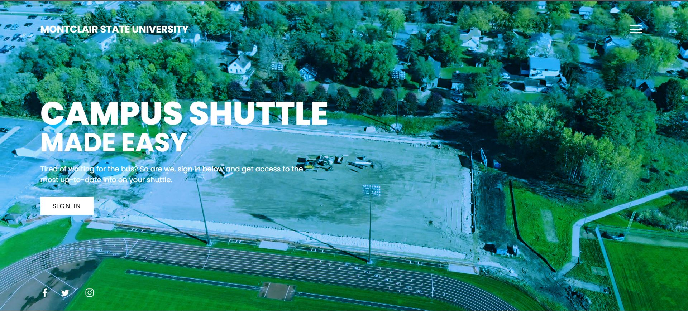

# MSU Shuttle

This website is designed to help users of a university campus track the location and estimated waiting times of campus shuttles in real-time. The site is split into two sections, students and drivers. **_All users must create an account to login and utilize the website._** 

## Developer Instructions

The student and driver portals should be entered into the `MSU-SHuttle/src/` folder, the entry point for the entire project is `MSU-Shuttle/index.html`. If you are not familiar with using PHP to establish a connection to a database I **_highly_** encourage you to review the documentation provided within `MSU-Shuttle/src/enroll.php` which can be found [here.]( https://github.com/RyanMcGrath1/MSU-Shuttle/blob/main/src/enroll.php)

## Features

- Real-time tracking of campus shuttles
- Estimated waiting times for shuttle pickups
- Map view with shuttle locations
- Ability to search for shuttle stops and routes
- User authentication and secure login


## Getting Started

To get started with the Online Campus Shuttle System, follow these steps:

1. Clone the repository to your local machine using the following command:

```sh
git clone https://github.com/RyanMcGrath1/MSU-Shuttle.git
```

2. Import them project into your preferred Java IDE.

3. Run the program from your IDE.

## Requirements

- PHP >= 7.3
- MySQL >= 5.7
- JavaScript
- XAMPP

If you do not have XAMPP installed I have included instructions on installation at the bottom of this page.


## Contributors

- **Ryan McGrath**
- **Carl Nonato**
- **Jigna Domadia**
- **Joyce David**
- **Taegan Maishman**


## Installing XAMPP

1. Visit the XAMPP website at [https://www.apachefriends.org/index.html](https://www.apachefriends.org/index.html)
2. Download the appropriate version of XAMPP for your operating system.
3. Run the installer and follow the instructions provided.
4. Once the installation is complete, launch XAMPP.

## Including XAMPP into a Project Structure

1. Create a new project folder on your local machine.
2. Within this folder, create a new subfolder named "htdocs".
3. Place all files and directories for your project inside the "htdocs" folder.
4. Open XAMPP and start the Apache server by clicking the "Start" button next to "Apache" in the XAMPP Control Panal.
5. In your web browser, navigate to **http://localhost/** to verify that the Apache server is running.
6. To access your project, navigate to **http://localhost/your-project-folder-name/** in your web browser.

Note: If your project requires a database, you can use the included MySQL database in XAMPP. Simply start the MySQL server in the XAMPP Control Panel and use the appropriate MySQL functions in your code to connect to the database.


## Images




